# EiffelBridge

This project provides a simple adapter service that simulates the GitLab → Eiffel integration bridge by receiving and processing **GitLab webhook-like** events locally.
Instead of connecting to a real GitLab instance, a lightweight built-in webhook emulator is implemented in Golang.
It accepts HTTP POST requests that mimic GitLab push events (via curl and JSON files), converts them into corresponding **Eiffel events**, and publishes them to **RabbitMQ** for downstream processing.

The purpose of adapter service to migrate CI/CD systems (e.g. Jenkins + Gerrit + Eiffel) into a **GitLab + Eiffel + RabbitMQ** architecture.

---

## 🔄 Architecture

```mermaid
flowchart LR
    subgraph GitLab
        A[Developer Commit/Push]
        B[GitLab Webhook JSON]
    end

    subgraph Adapter[GitLab → Eiffel Adapter]
        C[Webhook Endpoint /webhook]
        D[Translate GitLab JSON → Eiffel Event]
    end

    subgraph Broker[RabbitMQ]
        E[(Queue: eiffel.events)]
    end

    subgraph Consumers
        F[Consumer 1: Log Eiffel Events]
        G[Consumer 2: Trigger CI Job]
        H[Consumer 3: Dashboard / Monitoring]
    end

    A --> B
    B --> C
    C --> D
    D --> E
    E --> F
    E --> G
    E --> H
```



---

## Components
GitLab webhook emulator → generates webhook events on commits, merges, etc.

Adapter → receives webhook JSON, converts it to Eiffel event JSON.

RabbitMQ → acts as the central event bus (queue: eiffel.events).

Consumers → tools that subscribe to Eiffel events (cli, logging, CI triggers, dashboards).

---

## Deploy
Project includes a deployment script that sets up all components — Minikube, RabbitMQ and the EiffelBridge service on your local machine.

Run the deploy.py script from project root to deploy stack:
```bash
$ ./deploy.py
```

Script will:

- Build your EiffelBridge Docker image (if needed).

- Package & install EiffelBridge Helm chart.

- Expose services (via NodePort or port-forward).

- Print final curl + rabbitmqadmin commands for testing.

---

## Tear down
```bash
minikube delete
```
